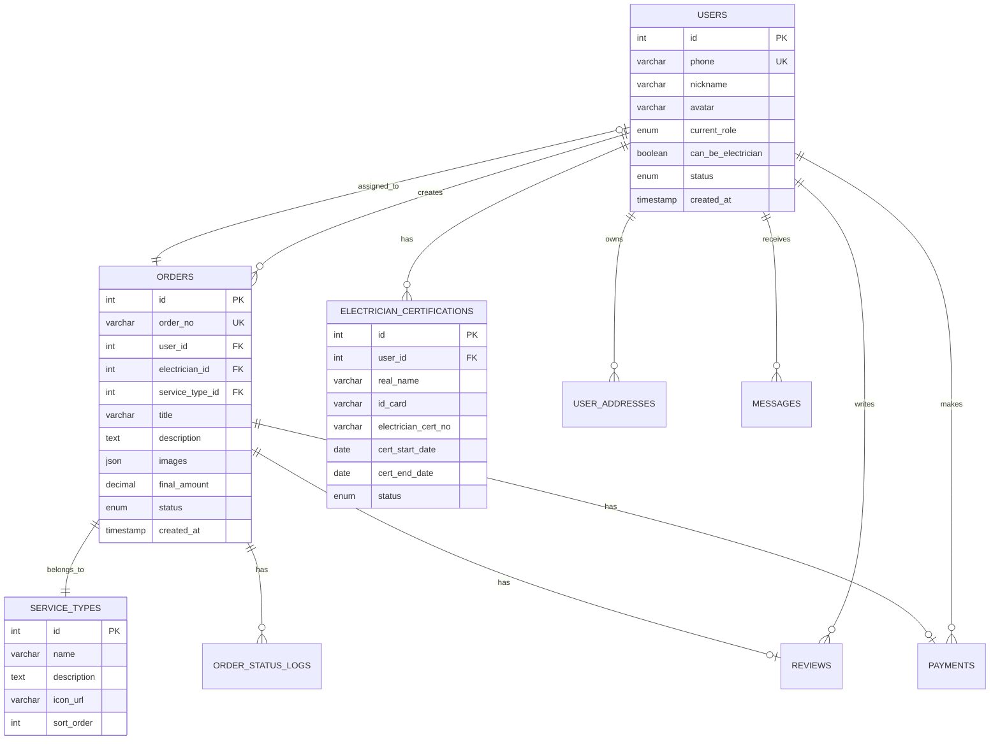

# 电工维修平台数据库设计文档

## 1. 数据库概述

基于MySQL 8.0设计，支持电工维修平台所有功能需求的数据存储和管理。

### 1.1 设计原则

* 支持用户和电工双角色设计

* 完整的订单状态流转

* 高效的地理位置查询

* 灵活的消息推送机制

* 可扩展的支付和评价系统

### 1.2 技术规范

* 数据库引擎：InnoDB

* 字符集：utf8mb4

* 排序规则：utf8mb4\_unicode\_ci

* 时区：Asia/Shanghai

## 2. 核心数据表设计

### 2.1 用户表 (users)

存储平台所有用户信息，支持普通用户和电工用户角色。

```sql
CREATE TABLE users (
    id INT PRIMARY KEY AUTO_INCREMENT COMMENT '用户ID',
    phone VARCHAR(11) UNIQUE NOT NULL COMMENT '手机号',
    nickname VARCHAR(50) DEFAULT NULL COMMENT '昵称',
    avatar VARCHAR(255) DEFAULT NULL COMMENT '头像URL',
    current_role ENUM('user', 'electrician') DEFAULT 'user' COMMENT '当前角色',
    can_be_electrician BOOLEAN DEFAULT FALSE COMMENT '是否可以成为电工',
    status ENUM('active', 'banned') DEFAULT 'active' COMMENT '用户状态',
    last_login_at TIMESTAMP NULL COMMENT '最后登录时间',
    created_at TIMESTAMP DEFAULT CURRENT_TIMESTAMP COMMENT '创建时间',
    updated_at TIMESTAMP DEFAULT CURRENT_TIMESTAMP ON UPDATE CURRENT_TIMESTAMP COMMENT '更新时间'
) COMMENT='用户表';
```

**字段说明：**

* `current_role`: 用户当前选择的角色

* `can_be_electrician`: 标识用户是否已完成电工认证，可以切换到电工角色

### 2.2 电工认证表 (electrician\_certifications)

存储电工实名认证信息。

```sql
CREATE TABLE electrician_certifications (
    id INT PRIMARY KEY AUTO_INCREMENT COMMENT '认证ID',
    user_id INT NOT NULL COMMENT '用户ID',
    real_name VARCHAR(50) NOT NULL COMMENT '真实姓名',
    id_card VARCHAR(18) NOT NULL COMMENT '身份证号',
    electrician_cert_no VARCHAR(50) NOT NULL COMMENT '电工证编号',
    cert_start_date DATE NOT NULL COMMENT '电工证有效期开始日期',
    cert_end_date DATE NOT NULL COMMENT '电工证有效期结束日期',
    status ENUM('pending', 'approved', 'rejected') DEFAULT 'approved' COMMENT '认证状态',
    reject_reason TEXT COMMENT '驳回原因',
    created_at TIMESTAMP DEFAULT CURRENT_TIMESTAMP COMMENT '创建时间',
    updated_at TIMESTAMP DEFAULT CURRENT_TIMESTAMP ON UPDATE CURRENT_TIMESTAMP COMMENT '更新时间',
    FOREIGN KEY (user_id) REFERENCES users(id) ON DELETE CASCADE
) COMMENT='电工认证表';
```

### 2.3 用户地址表 (user\_addresses)

存储用户的服务地址信息。

```sql
CREATE TABLE user_addresses (
    id INT PRIMARY KEY AUTO_INCREMENT COMMENT '地址ID',
    user_id INT NOT NULL COMMENT '用户ID',
    contact_name VARCHAR(50) NOT NULL COMMENT '联系人姓名',
    contact_phone VARCHAR(11) NOT NULL COMMENT '联系电话',
    province VARCHAR(50) NOT NULL COMMENT '省份',
    city VARCHAR(50) NOT NULL COMMENT '城市',
    district VARCHAR(50) NOT NULL COMMENT '区县',
    detail_address VARCHAR(255) NOT NULL COMMENT '详细地址',
    longitude DECIMAL(10,7) DEFAULT NULL COMMENT '经度',
    latitude DECIMAL(10,7) DEFAULT NULL COMMENT '纬度',
    is_default BOOLEAN DEFAULT FALSE COMMENT '是否默认地址',
    created_at TIMESTAMP DEFAULT CURRENT_TIMESTAMP COMMENT '创建时间',
    updated_at TIMESTAMP DEFAULT CURRENT_TIMESTAMP ON UPDATE CURRENT_TIMESTAMP COMMENT '更新时间',
    FOREIGN KEY (user_id) REFERENCES users(id) ON DELETE CASCADE
) COMMENT='用户地址表';
```

### 2.4 服务类型表 (service\_types)

存储维修服务类型。

```sql
CREATE TABLE service_types (
    id INT PRIMARY KEY AUTO_INCREMENT COMMENT '服务类型ID',
    name VARCHAR(50) NOT NULL COMMENT '服务类型名称',
    description TEXT COMMENT '服务描述',
    icon_url VARCHAR(255) COMMENT '图标URL',
    sort_order INT DEFAULT 0 COMMENT '排序',
    status ENUM('active', 'inactive') DEFAULT 'active' COMMENT '状态',
    created_at TIMESTAMP DEFAULT CURRENT_TIMESTAMP COMMENT '创建时间',
    updated_at TIMESTAMP DEFAULT CURRENT_TIMESTAMP ON UPDATE CURRENT_TIMESTAMP COMMENT '更新时间'
) COMMENT='服务类型表';
```

### 2.5 工单表 (orders)

存储维修工单信息，支持完整的状态流转。

```sql
CREATE TABLE orders (
    id INT PRIMARY KEY AUTO_INCREMENT COMMENT '工单ID',
    order_no VARCHAR(32) UNIQUE NOT NULL COMMENT '工单编号',
    user_id INT NOT NULL COMMENT '用户ID',
    electrician_id INT DEFAULT NULL COMMENT '电工ID',
    service_type_id INT NOT NULL COMMENT '服务类型ID',
    title VARCHAR(100) NOT NULL COMMENT '工单标题',
    description TEXT NOT NULL COMMENT '问题描述',
    images JSON COMMENT '问题图片URLs',
    contact_name VARCHAR(50) NOT NULL COMMENT '联系人',
    contact_phone VARCHAR(11) NOT NULL COMMENT '联系电话',
    service_address TEXT NOT NULL COMMENT '服务地址',
    longitude DECIMAL(10,7) DEFAULT NULL COMMENT '经度',
    latitude DECIMAL(10,7) DEFAULT NULL COMMENT '纬度',
    estimated_amount DECIMAL(10,2) DEFAULT 0 COMMENT '预估金额',
    final_amount DECIMAL(10,2) DEFAULT 0 COMMENT '最终金额',
    repair_content TEXT COMMENT '维修内容',
    repair_images JSON COMMENT '维修图片URLs',
    status ENUM('pending', 'accepted', 'in_progress', 'completed', 'paid', 'cancelled') DEFAULT 'pending' COMMENT '工单状态',
    cancel_reason TEXT COMMENT '取消原因',
    created_at TIMESTAMP DEFAULT CURRENT_TIMESTAMP COMMENT '创建时间',
    updated_at TIMESTAMP DEFAULT CURRENT_TIMESTAMP ON UPDATE CURRENT_TIMESTAMP COMMENT '更新时间',
    accepted_at TIMESTAMP NULL COMMENT '接单时间',
    completed_at TIMESTAMP NULL COMMENT '完成时间',
    paid_at TIMESTAMP NULL COMMENT '支付时间',
    cancelled_at TIMESTAMP NULL COMMENT '取消时间',
    FOREIGN KEY (user_id) REFERENCES users(id),
    FOREIGN KEY (electrician_id) REFERENCES users(id),
    FOREIGN KEY (service_type_id) REFERENCES service_types(id)
) COMMENT='工单表';
```

**状态说明：**

* `pending`: 待接单

* `accepted`: 已接单（进行中）

* `in_progress`: 进行中（电工已录入维修信息）

* `completed`: 已完成（待支付）

* `paid`: 已支付（已完成）

* `cancelled`: 已取消

### 2.6 工单状态日志表 (order\_status\_logs)

记录工单状态变更历史。

```sql
CREATE TABLE order_status_logs (
    id INT PRIMARY KEY AUTO_INCREMENT COMMENT '日志ID',
    order_id INT NOT NULL COMMENT '工单ID',
    from_status VARCHAR(20) COMMENT '原状态',
    to_status VARCHAR(20) NOT NULL COMMENT '新状态',
    operator_id INT COMMENT '操作人ID',
    operator_type ENUM('user', 'electrician', 'admin', 'system') NOT NULL COMMENT '操作人类型',
    remark TEXT COMMENT '备注',
    created_at TIMESTAMP DEFAULT CURRENT_TIMESTAMP COMMENT '创建时间',
    FOREIGN KEY (order_id) REFERENCES orders(id) ON DELETE CASCADE,
    FOREIGN KEY (operator_id) REFERENCES users(id)
) COMMENT='工单状态日志表';
```

### 2.7 支付记录表 (payments)

存储支付相关信息。

```sql
CREATE TABLE payments (
    id INT PRIMARY KEY AUTO_INCREMENT COMMENT '支付ID',
    order_id INT NOT NULL COMMENT '工单ID',
    user_id INT NOT NULL COMMENT '用户ID',
    amount DECIMAL(10,2) NOT NULL COMMENT '支付金额',
    payment_method ENUM('wechat', 'test') DEFAULT 'wechat' COMMENT '支付方式',
    transaction_id VARCHAR(64) COMMENT '微信交易号',
    out_trade_no VARCHAR(32) UNIQUE NOT NULL COMMENT '商户订单号',
    status ENUM('pending', 'success', 'failed', 'refunded') DEFAULT 'pending' COMMENT '支付状态',
    paid_at TIMESTAMP NULL COMMENT '支付时间',
    created_at TIMESTAMP DEFAULT CURRENT_TIMESTAMP COMMENT '创建时间',
    updated_at TIMESTAMP DEFAULT CURRENT_TIMESTAMP ON UPDATE CURRENT_TIMESTAMP COMMENT '更新时间',
    FOREIGN KEY (order_id) REFERENCES orders(id),
    FOREIGN KEY (user_id) REFERENCES users(id)
) COMMENT='支付记录表';
```

### 2.8 评价表 (reviews)

存储用户对电工的评价。

```sql
CREATE TABLE reviews (
    id INT PRIMARY KEY AUTO_INCREMENT COMMENT '评价ID',
    order_id INT NOT NULL COMMENT '工单ID',
    user_id INT NOT NULL COMMENT '用户ID',
    electrician_id INT NOT NULL COMMENT '电工ID',
    rating TINYINT NOT NULL COMMENT '评分(1-5)',
    content TEXT COMMENT '评价内容',
    images JSON COMMENT '评价图片URLs',
    created_at TIMESTAMP DEFAULT CURRENT_TIMESTAMP COMMENT '创建时间',
    updated_at TIMESTAMP DEFAULT CURRENT_TIMESTAMP ON UPDATE CURRENT_TIMESTAMP COMMENT '更新时间',
    FOREIGN KEY (order_id) REFERENCES orders(id),
    FOREIGN KEY (user_id) REFERENCES users(id),
    FOREIGN KEY (electrician_id) REFERENCES users(id)
) COMMENT='评价表';
```

### 2.9 消息表 (messages)

存储系统消息和订单通知。

```sql
CREATE TABLE messages (
    id INT PRIMARY KEY AUTO_INCREMENT COMMENT '消息ID',
    user_id INT NOT NULL COMMENT '接收用户ID',
    type ENUM('order', 'system') NOT NULL COMMENT '消息类型',
    title VARCHAR(100) NOT NULL COMMENT '消息标题',
    content TEXT NOT NULL COMMENT '消息内容',
    related_id INT COMMENT '关联ID(如工单ID)',
    is_read BOOLEAN DEFAULT FALSE COMMENT '是否已读',
    created_at TIMESTAMP DEFAULT CURRENT_TIMESTAMP COMMENT '创建时间',
    read_at TIMESTAMP NULL COMMENT '阅读时间',
    FOREIGN KEY (user_id) REFERENCES users(id) ON DELETE CASCADE
) COMMENT='消息表';
```

### 2.10 管理员表 (admins)

存储后台管理员信息。

```sql
CREATE TABLE admins (
    id INT PRIMARY KEY AUTO_INCREMENT COMMENT '管理员ID',
    username VARCHAR(50) UNIQUE NOT NULL COMMENT '用户名',
    password VARCHAR(255) NOT NULL COMMENT '密码(加密)',
    real_name VARCHAR(50) NOT NULL COMMENT '真实姓名',
    email VARCHAR(100) COMMENT '邮箱',
    status ENUM('active', 'inactive') DEFAULT 'active' COMMENT '状态',
    last_login_at TIMESTAMP NULL COMMENT '最后登录时间',
    created_at TIMESTAMP DEFAULT CURRENT_TIMESTAMP COMMENT '创建时间',
    updated_at TIMESTAMP DEFAULT CURRENT_TIMESTAMP ON UPDATE CURRENT_TIMESTAMP COMMENT '更新时间'
) COMMENT='管理员表';
```

### 2.11 系统配置表 (system\_configs)

存储系统配置信息。

```sql
CREATE TABLE system_configs (
    id INT PRIMARY KEY AUTO_INCREMENT COMMENT '配置ID',
    config_key VARCHAR(100) UNIQUE NOT NULL COMMENT '配置键',
    config_value TEXT COMMENT '配置值',
    description VARCHAR(255) COMMENT '配置描述',
    created_at TIMESTAMP DEFAULT CURRENT_TIMESTAMP COMMENT '创建时间',
    updated_at TIMESTAMP DEFAULT CURRENT_TIMESTAMP ON UPDATE CURRENT_TIMESTAMP COMMENT '更新时间'
) COMMENT='系统配置表';
```

## 3. 索引设计

### 3.1 用户表索引

```sql
-- 用户表索引
CREATE INDEX idx_users_phone ON users(phone);
CREATE INDEX idx_users_current_role ON users(current_role);
CREATE INDEX idx_users_status ON users(status);
CREATE INDEX idx_users_can_be_electrician ON users(can_be_electrician);
```

### 3.2 工单表索引

```sql
-- 工单表索引
CREATE INDEX idx_orders_user_id ON orders(user_id);
CREATE INDEX idx_orders_electrician_id ON orders(electrician_id);
CREATE INDEX idx_orders_status ON orders(status);
CREATE INDEX idx_orders_created_at ON orders(created_at);
CREATE INDEX idx_orders_location ON orders(longitude, latitude);
CREATE INDEX idx_orders_service_type ON orders(service_type_id);
CREATE INDEX idx_orders_status_created ON orders(status, created_at);
```

### 3.3 消息表索引

```sql
-- 消息表索引
CREATE INDEX idx_messages_user_id ON messages(user_id);
CREATE INDEX idx_messages_type ON messages(type);
CREATE INDEX idx_messages_is_read ON messages(is_read);
CREATE INDEX idx_messages_created_at ON messages(created_at);
CREATE INDEX idx_messages_user_type ON messages(user_id, type);
CREATE INDEX idx_messages_user_read ON messages(user_id, is_read);
```

### 3.4 其他索引

```sql
-- 支付记录索引
CREATE INDEX idx_payments_order_id ON payments(order_id);
CREATE INDEX idx_payments_user_id ON payments(user_id);
CREATE INDEX idx_payments_status ON payments(status);
CREATE INDEX idx_payments_out_trade_no ON payments(out_trade_no);

-- 评价表索引
CREATE INDEX idx_reviews_order_id ON reviews(order_id);
CREATE INDEX idx_reviews_electrician_id ON reviews(electrician_id);
CREATE INDEX idx_reviews_user_id ON reviews(user_id);

-- 地址表索引
CREATE INDEX idx_addresses_user_id ON user_addresses(user_id);
CREATE INDEX idx_addresses_default ON user_addresses(user_id, is_default);

-- 认证表索引
CREATE INDEX idx_certifications_user_id ON electrician_certifications(user_id);
CREATE INDEX idx_certifications_status ON electrician_certifications(status);
```

## 4. 数据库关系图



## 5. 初始数据

### 5.1 服务类型初始数据

```sql
INSERT INTO service_types (name, description, sort_order) VALUES
('电路维修', '家庭电路故障检修，包括短路、断路等问题', 1),
('开关插座', '开关插座安装、维修、更换', 2),
('灯具安装', '各类灯具安装、维修、更换', 3),
('电器维修', '家用电器维修、保养', 4),
('其他电工服务', '其他电工相关服务', 5);
```

### 5.2 管理员初始数据

```sql
-- 密码为 admin123，实际使用时需要加密
INSERT INTO admins (username, password, real_name, email) VALUES
('admin', '$2b$10$encrypted_password_hash', '系统管理员', 'admin@example.com');
```

### 5.3 系统配置初始数据

```sql
INSERT INTO system_configs (config_key, config_value, description) VALUES
('nearby_distance', '1000', '附近订单距离范围(米)'),
('message_poll_interval', '30', '消息轮询间隔(秒)'),
('max_image_size', '10485760', '图片最大大小(字节)'),
('max_image_count', '10', '最大图片数量'),
('supported_image_types', 'jpg,png,jpeg', '支持的图片格式'),
('test_sms_code', '123456', '测试环境短信验证码');
```

## 6. 数据库创建脚本

### 6.1 完整创建脚本

```sql
-- 创建数据库
CREATE DATABASE IF NOT EXISTS electrician_platform 
CHARACTER SET utf8mb4 
COLLATE utf8mb4_unicode_ci;

USE electrician_platform;

-- 设置时区
SET time_zone = '+08:00';

-- 创建所有表（按依赖关系顺序）
-- 1. 用户表
CREATE TABLE users (
    id INT PRIMARY KEY AUTO_INCREMENT COMMENT '用户ID',
    phone VARCHAR(11) UNIQUE NOT NULL COMMENT '手机号',
    nickname VARCHAR(50) DEFAULT NULL COMMENT '昵称',
    avatar VARCHAR(255) DEFAULT NULL COMMENT '头像URL',
    current_role ENUM('user', 'electrician') DEFAULT 'user' COMMENT '当前角色',
    can_be_electrician BOOLEAN DEFAULT FALSE COMMENT '是否可以成为电工',
    status ENUM('active', 'banned') DEFAULT 'active' COMMENT '用户状态',
    last_login_at TIMESTAMP NULL COMMENT '最后登录时间',
    created_at TIMESTAMP DEFAULT CURRENT_TIMESTAMP COMMENT '创建时间',
    updated_at TIMESTAMP DEFAULT CURRENT_TIMESTAMP ON UPDATE CURRENT_TIMESTAMP COMMENT '更新时间'
) COMMENT='用户表';

-- 2. 服务类型表
CREATE TABLE service_types (
    id INT PRIMARY KEY AUTO_INCREMENT COMMENT '服务类型ID',
    name VARCHAR(50) NOT NULL COMMENT '服务类型名称',
    description TEXT COMMENT '服务描述',
    icon_url VARCHAR(255) COMMENT '图标URL',
    sort_order INT DEFAULT 0 COMMENT '排序',
    status ENUM('active', 'inactive') DEFAULT 'active' COMMENT '状态',
    created_at TIMESTAMP DEFAULT CURRENT_TIMESTAMP COMMENT '创建时间',
    updated_at TIMESTAMP DEFAULT CURRENT_TIMESTAMP ON UPDATE CURRENT_TIMESTAMP COMMENT '更新时间'
) COMMENT='服务类型表';

-- 3. 电工认证表
CREATE TABLE electrician_certifications (
    id INT PRIMARY KEY AUTO_INCREMENT COMMENT '认证ID',
    user_id INT NOT NULL COMMENT '用户ID',
    real_name VARCHAR(50) NOT NULL COMMENT '真实姓名',
    id_card VARCHAR(18) NOT NULL COMMENT '身份证号',
    electrician_cert_no VARCHAR(50) NOT NULL COMMENT '电工证编号',
    cert_start_date DATE NOT NULL COMMENT '电工证有效期开始日期',
    cert_end_date DATE NOT NULL COMMENT '电工证有效期结束日期',
    status ENUM('pending', 'approved', 'rejected') DEFAULT 'approved' COMMENT '认证状态',
    reject_reason TEXT COMMENT '驳回原因',
    created_at TIMESTAMP DEFAULT CURRENT_TIMESTAMP COMMENT '创建时间',
    updated_at TIMESTAMP DEFAULT CURRENT_TIMESTAMP ON UPDATE CURRENT_TIMESTAMP COMMENT '更新时间',
    FOREIGN KEY (user_id) REFERENCES users(id) ON DELETE CASCADE
) COMMENT='电工认证表';

-- 4. 用户地址表
CREATE TABLE user_addresses (
    id INT PRIMARY KEY AUTO_INCREMENT COMMENT '地址ID',
    user_id INT NOT NULL COMMENT '用户ID',
    contact_name VARCHAR(50) NOT NULL COMMENT '联系人姓名',
    contact_phone VARCHAR(11) NOT NULL COMMENT '联系电话',
    province VARCHAR(50) NOT NULL COMMENT '省份',
    city VARCHAR(50) NOT NULL COMMENT '城市',
    district VARCHAR(50) NOT NULL COMMENT '区县',
    detail_address VARCHAR(255) NOT NULL COMMENT '详细地址',
    longitude DECIMAL(10,7) DEFAULT NULL COMMENT '经度',
    latitude DECIMAL(10,7) DEFAULT NULL COMMENT '纬度',
    is_default BOOLEAN DEFAULT FALSE COMMENT '是否默认地址',
    created_at TIMESTAMP DEFAULT CURRENT_TIMESTAMP COMMENT '创建时间',
    updated_at TIMESTAMP DEFAULT CURRENT_TIMESTAMP ON UPDATE CURRENT_TIMESTAMP COMMENT '更新时间',
    FOREIGN KEY (user_id) REFERENCES users(id) ON DELETE CASCADE
) COMMENT='用户地址表';

-- 5. 工单表
CREATE TABLE orders (
    id INT PRIMARY KEY AUTO_INCREMENT COMMENT '工单ID',
    order_no VARCHAR(32) UNIQUE NOT NULL COMMENT '工单编号',
    user_id INT NOT NULL COMMENT '用户ID',
    electrician_id INT DEFAULT NULL COMMENT '电工ID',
    service_type_id INT NOT NULL COMMENT '服务类型ID',
    title VARCHAR(100) NOT NULL COMMENT '工单标题',
    description TEXT NOT NULL COMMENT '问题描述',
    images JSON COMMENT '问题图片URLs',
    contact_name VARCHAR(50) NOT NULL COMMENT '联系人',
    contact_phone VARCHAR(11) NOT NULL COMMENT '联系电话',
    service_address TEXT NOT NULL COMMENT '服务地址',
    longitude DECIMAL(10,7) DEFAULT NULL COMMENT '经度',
    latitude DECIMAL(10,7) DEFAULT NULL COMMENT '纬度',
    estimated_amount DECIMAL(10,2) DEFAULT 0 COMMENT '预估金额',
    final_amount DECIMAL(10,2) DEFAULT 0 COMMENT '最终金额',
    repair_content TEXT COMMENT '维修内容',
    repair_images JSON COMMENT '维修图片URLs',
    status ENUM('pending', 'accepted', 'in_progress', 'completed', 'paid', 'cancelled') DEFAULT 'pending' COMMENT '工单状态',
    cancel_reason TEXT COMMENT '取消原因',
    created_at TIMESTAMP DEFAULT CURRENT_TIMESTAMP COMMENT '创建时间',
    updated_at TIMESTAMP DEFAULT CURRENT_TIMESTAMP ON UPDATE CURRENT_TIMESTAMP COMMENT '更新时间',
    accepted_at TIMESTAMP NULL COMMENT '接单时间',
    completed_at TIMESTAMP NULL COMMENT '完成时间',
    paid_at TIMESTAMP NULL COMMENT '支付时间',
    cancelled_at TIMESTAMP NULL COMMENT '取消时间',
    FOREIGN KEY (user_id) REFERENCES users(id),
    FOREIGN KEY (electrician_id) REFERENCES users(id),
    FOREIGN KEY (service_type_id) REFERENCES service_types(id)
) COMMENT='工单表';

-- 6. 工单状态日志表
CREATE TABLE order_status_logs (
    id INT PRIMARY KEY AUTO_INCREMENT COMMENT '日志ID',
    order_id INT NOT NULL COMMENT '工单ID',
    from_status VARCHAR(20) COMMENT '原状态',
    to_status VARCHAR(20) NOT NULL COMMENT '新状态',
    operator_id INT COMMENT '操作人ID',
    operator_type ENUM('user', 'electrician', 'admin', 'system') NOT NULL COMMENT '操作人类型',
    remark TEXT COMMENT '备注',
    created_at TIMESTAMP DEFAULT CURRENT_TIMESTAMP COMMENT '创建时间',
    FOREIGN KEY (order_id) REFERENCES orders(id) ON DELETE CASCADE,
    FOREIGN KEY (operator_id) REFERENCES users(id)
) COMMENT='工单状态日志表';

-- 7. 支付记录表
CREATE TABLE payments (
    id INT PRIMARY KEY AUTO_INCREMENT COMMENT '支付ID',
    order_id INT NOT NULL COMMENT '工单ID',
    user_id INT NOT NULL COMMENT '用户ID',
    amount DECIMAL(10,2) NOT NULL COMMENT '支付金额',
    payment_method ENUM('wechat', 'test') DEFAULT 'wechat' COMMENT '支付方式',
    transaction_id VARCHAR(64) COMMENT '微信交易号',
    out_trade_no VARCHAR(32) UNIQUE NOT NULL COMMENT '商户订单号',
    status ENUM('pending', 'success', 'failed', 'refunded') DEFAULT 'pending' COMMENT '支付状态',
    paid_at TIMESTAMP NULL COMMENT '支付时间',
    created_at TIMESTAMP DEFAULT CURRENT_TIMESTAMP COMMENT '创建时间',
    updated_at TIMESTAMP DEFAULT CURRENT_TIMESTAMP ON UPDATE CURRENT_TIMESTAMP COMMENT '更新时间',
    FOREIGN KEY (order_id) REFERENCES orders(id),
    FOREIGN KEY (user_id) REFERENCES users(id)
) COMMENT='支付记录表';

-- 8. 评价表
CREATE TABLE reviews (
    id INT PRIMARY KEY AUTO_INCREMENT COMMENT '评价ID',
    order_id INT NOT NULL COMMENT '工单ID',
    user_id INT NOT NULL COMMENT '用户ID',
    electrician_id INT NOT NULL COMMENT '电工ID',
    rating TINYINT NOT NULL COMMENT '评分(1-5)',
    content TEXT COMMENT '评价内容',
    images JSON COMMENT '评价图片URLs',
    created_at TIMESTAMP DEFAULT CURRENT_TIMESTAMP COMMENT '创建时间',
    updated_at TIMESTAMP DEFAULT CURRENT_TIMESTAMP ON UPDATE CURRENT_TIMESTAMP COMMENT '更新时间',
    FOREIGN KEY (order_id) REFERENCES orders(id),
    FOREIGN KEY (user_id) REFERENCES users(id),
    FOREIGN KEY (electrician_id) REFERENCES users(id)
) COMMENT='评价表';

-- 9. 消息表
CREATE TABLE messages (
    id INT PRIMARY KEY AUTO_INCREMENT COMMENT '消息ID',
    user_id INT NOT NULL COMMENT '接收用户ID',
    type ENUM('order', 'system') NOT NULL COMMENT '消息类型',
    title VARCHAR(100) NOT NULL COMMENT '消息标题',
    content TEXT NOT NULL COMMENT '消息内容',
    related_id INT COMMENT '关联ID(如工单ID)',
    is_read BOOLEAN DEFAULT FALSE COMMENT '是否已读',
    created_at TIMESTAMP DEFAULT CURRENT_TIMESTAMP COMMENT '创建时间',
    read_at TIMESTAMP NULL COMMENT '阅读时间',
    FOREIGN KEY (user_id) REFERENCES users(id) ON DELETE CASCADE
) COMMENT='消息表';

-- 10. 管理员表
CREATE TABLE admins (
    id INT PRIMARY KEY AUTO_INCREMENT COMMENT '管理员ID',
    username VARCHAR(50) UNIQUE NOT NULL COMMENT '用户名',
    password VARCHAR(255) NOT NULL COMMENT '密码(加密)',
    real_name VARCHAR(50) NOT NULL COMMENT '真实姓名',
    email VARCHAR(100) COMMENT '邮箱',
    status ENUM('active', 'inactive') DEFAULT 'active' COMMENT '状态',
    last_login_at TIMESTAMP NULL COMMENT '最后登录时间',
    created_at TIMESTAMP DEFAULT CURRENT_TIMESTAMP COMMENT '创建时间',
    updated_at TIMESTAMP DEFAULT CURRENT_TIMESTAMP ON UPDATE CURRENT_TIMESTAMP COMMENT '更新时间'
) COMMENT='管理员表';

-- 11. 系统配置表
CREATE TABLE system_configs (
    id INT PRIMARY KEY AUTO_INCREMENT COMMENT '配置ID',
    config_key VARCHAR(100) UNIQUE NOT NULL COMMENT '配置键',
    config_value TEXT COMMENT '配置值',
    description VARCHAR(255) COMMENT '配置描述',
    created_at TIMESTAMP DEFAULT CURRENT_TIMESTAMP COMMENT '创建时间',
    updated_at TIMESTAMP DEFAULT CURRENT_TIMESTAMP ON UPDATE CURRENT_TIMESTAMP COMMENT '更新时间'
) COMMENT='系统配置表';
```

### 6.2 索引创建脚本

```sql
-- 创建所有索引
-- 用户表索引
CREATE INDEX idx_users_phone ON users(phone);
CREATE INDEX idx_users_current_role ON users(current_role);
CREATE INDEX idx_users_status ON users(status);
CREATE INDEX idx_users_can_be_electrician ON users(can_be_electrician);

-- 工单表索引
CREATE INDEX idx_orders_user_id ON orders(user_id);
CREATE INDEX idx_orders_electrician_id ON orders(electrician_id);
CREATE INDEX idx_orders_status ON orders(status);
CREATE INDEX idx_orders_created_at ON orders(created_at);
CREATE INDEX idx_orders_location ON orders(longitude, latitude);
CREATE INDEX idx_orders_service_type ON orders(service_type_id);
CREATE INDEX idx_orders_status_created ON orders(status, created_at);

-- 消息表索引
CREATE INDEX idx_messages_user_id ON messages(user_id);
CREATE INDEX idx_messages_type ON messages(type);
CREATE INDEX idx_messages_is_read ON messages(is_read);
CREATE INDEX idx_messages_created_at ON messages(created_at);
CREATE INDEX idx_messages_user_type ON messages(user_id, type);
CREATE INDEX idx_messages_user_read ON messages(user_id, is_read);

-- 支付记录索引
CREATE INDEX idx_payments_order_id ON payments(order_id);
CREATE INDEX idx_payments_user_id ON payments(user_id);
CREATE INDEX idx_payments_status ON payments(status);
CREATE INDEX idx_payments_out_trade_no ON payments(out_trade_no);

-- 评价表索引
CREATE INDEX idx_reviews_order_id ON reviews(order_id);
CREATE INDEX idx_reviews_electrician_id ON reviews(electrician_id);
CREATE INDEX idx_reviews_user_id ON reviews(user_id);

-- 地址表索引
CREATE INDEX idx_addresses_user_id ON user_addresses(user_id);
CREATE INDEX idx_addresses_default ON user_addresses(user_id, is_default);

-- 认证表索引
CREATE INDEX idx_certifications_user_id ON electrician_certifications(user_id);
CREATE INDEX idx_certifications_status ON electrician_certifications(status);
```

### 6.3 初始数据插入脚本

```sql
-- 插入初始数据
-- 服务类型
INSERT INTO service_types (name, description, sort_order) VALUES
('电路维修', '家庭电路故障检修，包括短路、断路等问题', 1),
('开关插座', '开关插座安装、维修、更换', 2),
('灯具安装', '各类灯具安装、维修、更换', 3),
('电器维修', '家用电器维修、保养', 4),
('其他电工服务', '其他电工相关服务', 5);

-- 管理员账号（密码需要实际加密）
INSERT INTO admins (username, password, real_name, email) VALUES
('admin', '$2b$10$encrypted_password_hash', '系统管理员', 'admin@example.com');

-- 系统配置
INSERT INTO system_configs (config_key, config_value, description) VALUES
('nearby_distance', '1000', '附近订单距离范围(米)'),
('message_poll_interval', '30', '消息轮询间隔(秒)'),
('max_image_size', '10485760', '图片最大大小(字节)'),
('max_image_count', '10', '最大图片数量'),
('supported_image_types', 'jpg,png,jpeg', '支持的图片格式'),
('test_sms_code', '123456', '测试环境短信验证码');
```

## 7. 数据库配置建议

### 7.1 MySQL配置优化

```ini
# MySQL配置文件 my.cnf
[mysqld]
# 字符集配置
character-set-server=utf8mb4
collation-server=utf8mb4_unicode_ci

# 时区配置
default-time-zone='+08:00'

# 性能配置
innodb_buffer_pool_size=1G
innodb_log_file_size=256M
max_connections=200

# 安全配置
sql_mode=STRICT_TRANS_TABLES,NO_ZERO_DATE,NO_ZERO_IN_DATE,ERROR_FOR_DIVISION_BY_ZERO
```

### 7.2 连接池配置

```javascript
// Node.js 连接池配置示例
const mysql = require('mysql2/promise');

const pool = mysql.createPool({
  host: 'localhost',
  user: 'root',
  password: 'password',
  database: 'electrician_platform',
  charset: 'utf8mb4',
  timezone: '+08:00',
  connectionLimit: 20,
  queueLimit: 0,
  acquireTimeout: 60000,
  timeout: 60000
});
```

## 8. 数据维护和备份

### 8.1 定期清理策略

```sql
-- 清理30天前的状态日志
DELETE FROM order_status_logs WHERE created_at < DATE_SUB(NOW(), INTERVAL 30 DAY);

-- 清理已读的系统消息（保留7天）
DELETE FROM messages 
WHERE type = 'system' 
AND is_read = TRUE 
AND read_at < DATE_SUB(NOW(), INTERVAL 7 DAY);
```

### 8.2 备份脚本

```bash
#!/bin/bash
# 数据库备份脚本
DATE=$(date +%Y%m%d_%H%M%S)
BACKUP_DIR="/backup/mysql"
DB_NAME="electrician_platform"

mysqldump -u root -p$MYSQL_PASSWORD \
  --single-transaction \
  --routines \
  --triggers \
  $DB_NAME > $BACKUP_DIR/electrician_platform_$DATE.sql

# 压缩备份文件
gzip $BACKUP_DIR/electrician_platform_$DATE.sql

# 删除7天前的备份
find $BACKUP_DIR -name "electrician_platform_*.sql.gz" -mtime +7 -delete
```

***

**注意事项：**

1. 生产环境部署前需要修改默认密码和敏感配置
2. 建议定期备份数据库并测试恢复流程
3. 根据实际业务量调整索引和配置参数
4. 监控数据库性能，及时优化慢查询
5. 定期清理历史数据，保持数据库性能

