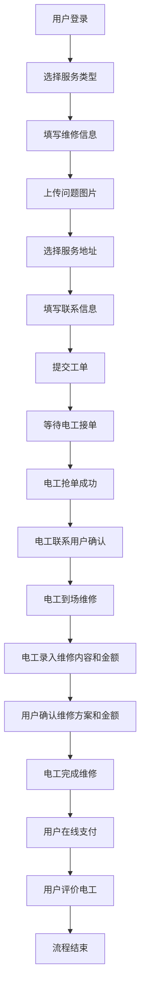
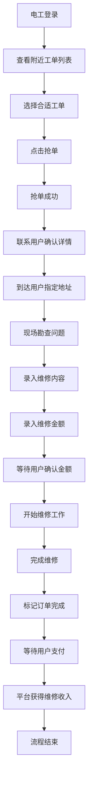
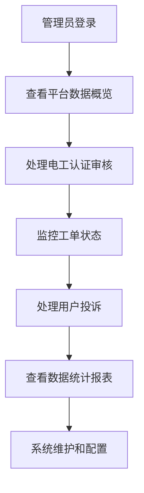

# 电工维修平台微信小程序最终需求文档

## 1. 产品概述

电工维修平台是一个基于微信小程序的O2O服务平台，连接有维修需求的用户和专业电工。用户可以在线下单，电工抢单接单，完成维修后在线支付和评价，实现维修服务的数字化闭环。

产品采用双角色设计，用户端和电工端统一在同一小程序内，通过角色识别加载不同的功能界面，提供便捷的维修服务体验。

## 2. 核心功能需求分析

### 2.1 用户角色定义

| 角色   | 注册方式                          | 核心权限              |
| ---- | ----------------------------- | ----------------- |
| 普通用户 | 手机号验证                         | 下单、支付、评价、查看工单状态   |
| 电工用户 | 手机号验证、实名认证（姓名、身份证号、电工证编号及有效期） | 接单、录入维修内容和金额、完成工单 |
| 管理员  | pc端后台账号登录                     | 用户管理、电工管理、工单管理    |

### 2.2 功能模块架构

#### 小程序端功能模块

电工维修平台微信小程序采用底部Tab导航，包含4个主要模块：

1. **首页模块**

   * 定位功能（左上角定位图标 + 城市名）

   * 用户视图：下单入口、已成交订单列表

   * 电工视图：附近最新未成交订单列表、抢单功能

2. **订单模块**

   * 4个状态Tab：待接单、进行中、待支付、已完成

   * 订单状态管理和操作功能

   * 用户和电工的不同操作权限

3. **消息模块**

   * 订单通知（订单状态变化实时通知）

   * 系统通知（系统消息推送）

4. **我的模块**

   * 用户信息管理

   * 角色切换功能

   * 地址管理（仅用户）

   * 电工实名认证入口（用户可以在我的模块中进行认证，电工认证后点击则显示认证结果、认证信息更新）

   * 系统设置

#### PC端管理后台

* 用户管理

* 电工管理

* 工单管理

* 系统通知发布（管理员可以在后台发布系统通知，用户端会实时收到通知）

## 3. 详细页面功能需求

### 3.1 登录页

**页面描述：** 手机号登录页面，顶部LOGO，占位符输入框（手机号、验证码），验证码按钮，主色调蓝色，底部隐私协议链接，简洁居中布局。

**功能需求：**

* 手机号格式验证

* 验证码发送功能（60秒倒计时）

* 登录状态保持

* 隐私协议链接跳转

* 登录成功后角色识别和页面跳转

**技术要点：**

* 微信小程序授权登录

* 手机号正则验证

* 短信验证码接口集成。测试环境下使用固定验证码。

* JWT Token管理

### 3.2 用户首页

**页面描述：** 顶部定位条（左上角定位图标 + 城市名），下方大按钮"立即下单"，下方卡片区域展示"已成交订单列表"，整体卡片风格，浅灰背景。

**功能需求：**

* 自动获取用户地理位置

* 城市名称显示

* 立即下单按钮（跳转下单页面）

* 已成交订单列表展示（最近5条）

* 不能点击查看订单详情

**技术要点：**

* 微信小程序地理位置API

* 地址逆解析服务

* 订单数据分页加载

* 卡片式UI组件设计

### 3.3 电工首页

**页面描述：** 列表页风格，展示"附近订单"，卡片包含用户地址、问题简述、发布时间，右下角有"抢单"按钮，主色突出操作。

**功能需求：**

* 基于电工位置显示附近订单

* 订单信息展示：地址、问题描述、发布时间

* 抢单功能（防重复抢单，先到先得）

* 订单列表实时刷新

* 距离计算和排序

**技术要点：**

* 地理位置距离计算算法

* 实时数据推送（定时拉取订单数据）

* 并发抢单控制

* 列表虚拟滚动优化

### 3.4 下单表单页

**页面描述：** 多步骤表单风格：服务类型选择（单选按钮组）、描述输入框、图片上传组件、地址选择按钮、联系人输入、电话输入，底部大按钮"提交订单"。

**功能需求：**

* 服务类型单选（电路维修、开关插座、灯具安装等）

* 问题描述文本输入（限制字数）

* 图片上传功能（最多3张，非必填）

* 地址选择（从地址管理中选择或新增）

* 联系人和电话信息填写

* 表单验证和提交

**技术要点：**

* 表单数据验证

* 图片压缩和上传

* 地址选择器组件

* 表单状态管理

### 3.5 订单列表页

**页面描述：** 顶部4个Tab（待接单/进行中/待支付/已完成），下方订单卡片展示：订单号、状态、摘要、金额，点击进入订单详情。

**功能需求：**

* Tab切换显示不同状态订单

* 订单卡片信息展示

* 下拉刷新和上拉加载更多

* 订单状态实时更新

* 点击卡片进入详情页

**状态说明：**

* **待接单**：用户可取消，电工可接单

* **进行中**：用户可取消、确认金额、联系电工；电工可录入/修改维修内容和金额、完成订单、联系用户

* **待支付**：电工完成后，用户进行支付

* **已完成**：用户可评价，查看评价

**技术要点：**

* Tab组件状态管理

* 订单状态枚举定义

* 实时状态同步

* 分页数据加载

### 3.6 订单详情页

**页面描述：** 卡片分区：用户信息/电工信息/维修内容/金额/状态。底部按钮根据状态变化（取消、确认金额、支付、评价）。使用蓝色主按钮+灰色副按钮。

**功能需求：**

* 订单基本信息展示

* 用户和电工信息展示

* 维修内容和图片展示

* 金额信息展示

* 根据订单状态显示相应操作按钮

* 联系功能（拨打电话）

**操作按钮逻辑：**

* 待接单状态：用户显示"取消订单"，电工显示"接单"

* 进行中状态：用户显示"取消订单"、"确认金额"，电工显示"录入维修信息"、"完成订单"

* 待支付状态：用户显示"立即支付"，测试环境点击可直接跳转到支付成功页，不调用接口。

* 已完成状态：用户显示"评价"或"查看评价"

**技术要点：**

* 动态按钮渲染

* 状态机模式设计

* 微信支付集成

* 电话拨打功能

### 3.7 消息中心页

**页面描述：** Tab切换（订单通知/系统通知），列表样式，每条消息卡片含标题、摘要、时间，未读消息左侧红点。

**功能需求：**

* 消息分类Tab切换

* 消息列表展示

* 未读消息标识

* 消息已读状态更新

* 消息点击查看详情

**消息类型：**

* 订单通知：订单状态变化、抢单成功、支付成功等

* 系统通知：平台公告、维护通知等

**技术要点：**

* 消息推送机制（轮询）

* 未读消息计数

* 消息状态管理

* 实时消息接收

### 3.8 我的页面

**页面描述：** 顶部头像+昵称+手机号，列表入口：角色切换、电工实名认证、地址管理、设置。采用图标+文字的列表单元格样式。

**功能需求：**

* 用户基本信息展示

* 角色切换入口

* 功能菜单列表

* 头像上传和修改

* 昵称编辑功能

**菜单项：**

* 角色切换（用户/电工）

* 电工实名认证（仅电工角色显示）

* 地址管理（仅用户角色显示）

* 设置

**技术要点：**

* 角色权限控制

* 头像上传处理

* 用户信息编辑

* 菜单动态显示

### 3.9 地址管理页

**页面描述：** 地址卡片（姓名、电话、地址），右上角"编辑/删除"按钮。

**功能需求：**

* 地址编辑功能

**技术要点：**

* 地址数据CRUD操作

* 地址选择器组件

* 地理位置获取

### 3.10 电工实名认证页

**页面描述：** 表单式：姓名、身份证号、电工证号、有效期开始日期、结束日期。底部蓝色"提交"按钮。

**功能需求：**

* 实名信息表单填写

* 有效期开始日期、结束日期选择

* 身份证号填写

* 认证信息提交

**技术要点：**

* 日期选择器

### 3.11 认证状态页

**页面描述：** 居中状态页，图标+文字（"认证通过"），风格简洁，带返回按钮。

**功能需求：**

* 认证状态展示

* 认证信息查看(认证信息更新入口)

* 重新认证入口（如果被驳回）

**认证状态：**

* 待审核

* 认证通过

* 认证驳回

### 3.12 设置页

**页面描述：** 简单列表，功能项：退出登录、隐私协议。底部红色"退出登录"按钮。

**功能需求：**

* 隐私协议查看

* 退出登录功能

* 清除本地数据

## 4. 核心业务流程设计

### 4.1 用户下单流程

**关键节点说明：**

1. **工单创建**：用户填写完整信息后创建工单，状态为"待接单"
2. **电工抢单**：电工在附近订单中选择合适工单进行抢单
3. **金额确认**：电工录入维修内容和金额后，需要用户确认
4. **支付环节**：电工完成维修后，订单状态变为"待支付"
5. **评价环节**：支付完成后，用户可以对电工进行评价

### 4.2 电工接单流程

**关键节点说明：**

1. **抢单机制**：同一工单只能被一个电工抢到，需要防止并发问题
2. **用户沟通**：抢单成功后电工需要主动联系用户确认服务详情
3. **金额录入**：电工需要根据实际情况录入维修内容和金额
4. **完成确认**：电工完成维修后需要标记订单完成

### 4.3 管理员流程

## 5. 技术实现要点

### 5.1 微信小程序技术要点

**开发框架：** 微信小程序原生开发 + WeUI组件库

**关键技术：**

* 微信授权登录

* 地理位置获取和计算

* 图片上传和压缩

* 微信支付集成

* 实时消息推送

* 本地数据存储

**性能优化：**

* 图片懒加载

* 列表虚拟滚动

* 数据缓存策略

* 代码分包加载

### 5.2 后端技术要点

**技术栈：** Node.js + Express.js + MySQL + Redis

**核心功能：**

* RESTful API设计

* JWT身份认证

* 文件上传处理

* 微信支付回调

* 地理位置计算

**数据库设计：**

* 用户表（支持角色切换）

* 工单表（状态流转）

* 支付记录表

* 消息通知表

* 电工认证表

### 5.3 安全和性能考虑

**安全措施：**

* API接口鉴权

* 数据传输加密

* 敏感信息脱敏

* 防重复提交

* SQL注入防护

**性能优化：**

* 数据库索引优化

* Redis缓存策略

* CDN静态资源加速

* API响应时间监控

## 6. 待确认问题

### 6.1 业务逻辑问题

1. **抢单机制细节**：

   * 多个电工同时抢单时的处理策略？
     回答：多个电工同时抢单时，系统会根据工单的创建时间和电工的距离进行排序，先到先服务。

   * 是否有抢单时间限制？
     回答：无。

   * 抢单失败后是否有重试机制？
     回答：无。

2. **订单取消规则**：

   * 用户在"进行中"状态取消订单，电工是否有补偿？
     回答：无。

   * 取消订单的时间限制？
     回答：无。

   * 频繁取消订单的用户是否有惩罚机制？
     回答：无。

3. **金额确认流程**：

   * 用户不确认电工录入的金额怎么办？
     回答：用户不确认电工录入的金额，管理员在后台人工处理。

   * 是否支持金额协商功能？
     回答：无。

   * 金额确认的超时处理？
     回答：无。

4. **支付超时处理**：

   * 用户长时间不支付的处理机制？
     回答：无。

   * 支付超时时间设置？
     回答：无。

   * 超时后订单状态如何变更？
     回答：无。

### 6.2 技术实现问题

1. **实名认证流程**：

   * 文档提到"上传即通过"，是否需要人工审核？
     回答：上传即通过。

   * 认证信息的验证规则？
     回答：无。

   * 认证失败的处理流程？
     回答：无。

2. **定位功能精度**：

   * 需要精确到具体地址还是城市级别？
     回答：精确到具体地址。

   * 电工查看附近订单的距离范围？
     回答：1000米。

   * 定位失败的降级方案？
     回答：用户手工填写。

3. **联系功能实现**：

   * 用户和电工联系是通过平台内消息还是直接电话？
     回答：通过平台内消息。

   * 是否需要保护双方隐私（虚拟号码）？
     回答：无。

4. **图片上传限制**：

   * 图片大小和数量限制？
     回答：10MB，10张。

   * 图片格式要求？
     回答：jpg、png、jpeg。

   * 图片存储和CDN方案？
     回答：存储在服务器本地，通过CDN加速。

### 6.3 用户体验问题

1. **角色切换体验**：

   * 切换角色后是否需要重新登录？
     回答：无。

   * 角色切换的权限验证？
     回答：无。

   * 切换后的数据隔离？
     回答：无。

2. **消息推送策略**：

   * 推送消息的频率控制？
     回答：每30秒推送一次。

   * 用户是否可以自定义推送设置？
     回答：无。

   * 推送消息的内容模板？
     回答：无。

3. **评价系统设计**：

   * 是否支持匿名评价？
     回答：无。

   * 评价是否可以修改？
     回答：无。

   * 恶意评价的处理机制？
     回答：无。

## 7. 开发优先级建议

### 第一阶段（核心功能）

1. 用户登录和角色管理
2. 基础的下单和抢单功能
3. 订单状态管理
4. 基础的支付功能

### 第二阶段（完善功能）

1. 消息推送系统
2. 评价系统
3. 地址管理
4. 电工实名认证

### 第三阶段（优化功能）

1. 管理后台
2. 数据统计
3. 性能优化
4. 用户体验优化

