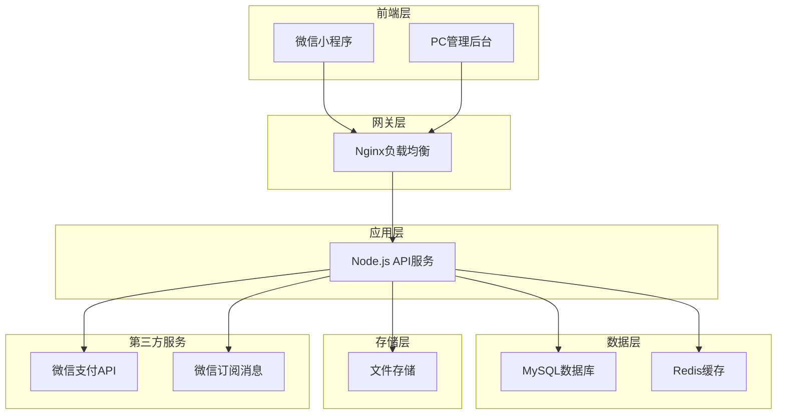
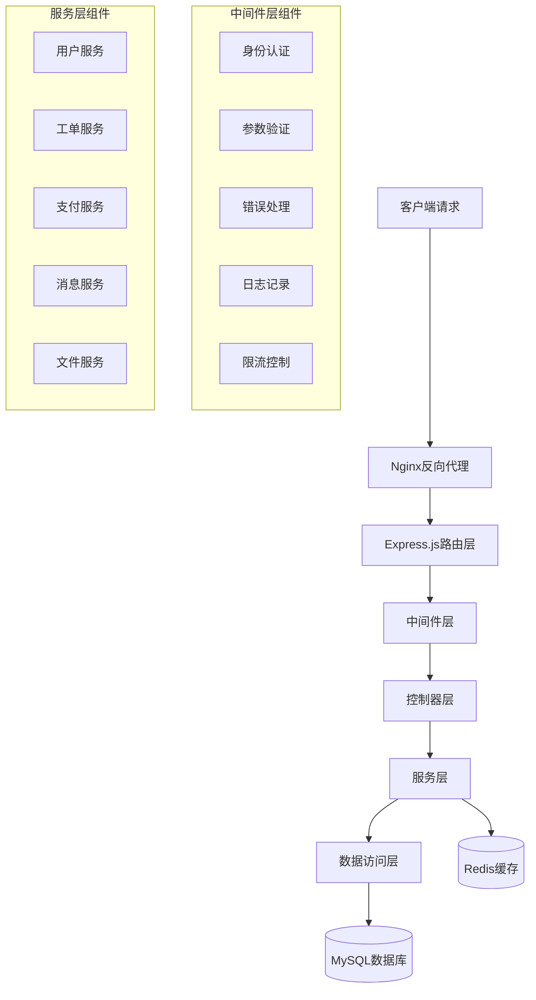
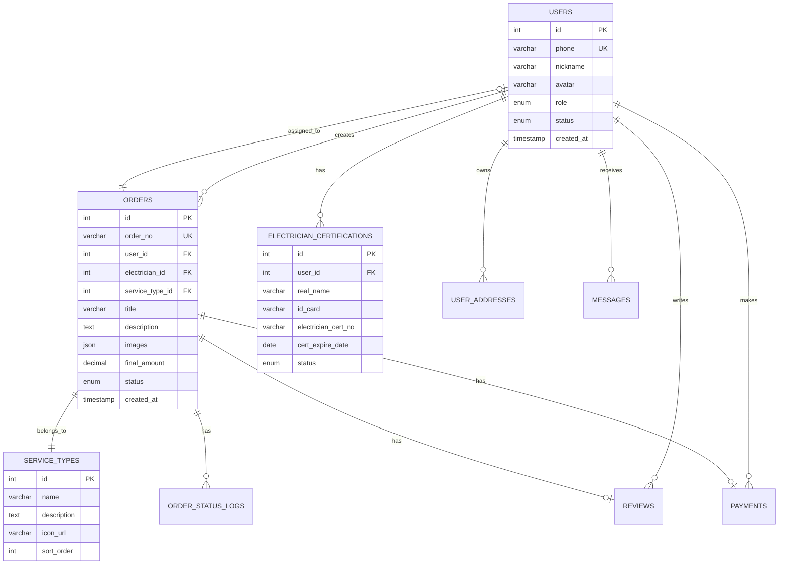

# 电工维修平台技术架构设计文档

## 1. 架构设计



## 2. 技术描述

### 2.1 前端技术栈
- **微信小程序**：原生开发 + WeUI组件库
- **PC管理后台**：Vue.js 3 + Element Plus + Vite
- **状态管理**：Pinia (Vue) / 小程序全局状态
- **HTTP客户端**：Axios / 小程序wx.request

### 2.2 后端技术栈
- **运行环境**：Node.js 18+
- **Web框架**：Express.js 4.x
- **实时通信**：Socket.io
- **身份认证**：JWT + Redis Session
- **参数验证**：Joi
- **日志记录**：Winston
- **进程管理**：PM2

### 2.3 数据存储
- **关系数据库**：MySQL 8.0
- **缓存数据库**：Redis 6.x
- **文件存储**：本地文件系统 (后期可扩展OSS)

### 2.4 第三方服务
- **支付服务**：微信支付API v3
- **消息推送**：微信订阅消息
- **地图服务**：腾讯地图API (定位、距离计算)

## 3. 路由定义

### 3.1 微信小程序路由

| 路由 | 页面说明 |
|------|----------|
| /pages/login/login | 登录页面 |
| /pages/index/index | 首页 (用户/电工切换) |
| /pages/order/list | 订单列表页 |
| /pages/order/detail | 订单详情页 |
| /pages/order/create | 创建订单页 |
| /pages/message/list | 消息中心 |
| /pages/profile/index | 个人中心 |
| /pages/profile/address | 地址管理 |
| /pages/profile/certification | 电工认证 |
| /pages/profile/settings | 设置页面 |

### 3.2 PC管理后台路由

| 路由 | 页面说明 |
|------|----------|
| /login | 管理员登录 |
| /dashboard | 数据概览 |
| /users | 用户管理 |
| /electricians | 电工管理 |
| /orders | 工单管理 |
| /messages | 消息管理 |

## 4. API定义

### 4.1 核心API模块

**用户认证模块**
```
POST /api/auth/send-code     # 发送验证码
POST /api/auth/login         # 手机号登录
GET  /api/auth/profile       # 获取用户信息
POST /api/auth/switch-role   # 角色切换
```

**工单管理模块**
```
POST /api/orders             # 创建工单
GET  /api/orders             # 获取工单列表
GET  /api/orders/{id}        # 获取工单详情
POST /api/orders/{id}/accept # 电工抢单
POST /api/orders/{id}/cancel # 取消工单
PUT  /api/orders/{id}/repair-info # 更新维修信息
POST /api/orders/{id}/complete    # 完成工单
GET  /api/orders/nearby      # 获取附近工单
```

**支付模块**
```
POST /api/payments/create    # 创建支付订单
GET  /api/payments/{id}/status # 查询支付状态
POST /api/payments/notify    # 微信支付回调
```

**文件上传**
```
POST /api/upload/image       # 图片上传
```

### 4.2 请求/响应示例

**创建工单接口**
```
POST /api/orders
```

请求参数：
| 参数名 | 类型 | 必填 | 说明 |
|--------|------|------|------|
| service_type_id | number | 是 | 服务类型ID |
| title | string | 是 | 工单标题 |
| description | string | 是 | 问题描述 |
| contact_name | string | 是 | 联系人 |
| contact_phone | string | 是 | 联系电话 |
| service_address | string | 是 | 服务地址 |

响应示例：
```json
{
  "code": 200,
  "message": "工单创建成功",
  "data": {
    "order_id": 1,
    "order_no": "ORD202401010001"
  }
}
```

## 5. 服务器架构图



## 6. 数据模型

### 6.1 核心实体关系图



### 6.2 数据库配置

**MySQL配置**
```sql
-- 字符集配置
CHARACTER SET utf8mb4 COLLATE utf8mb4_unicode_ci;

-- 连接池配置
max_connections = 200
innodb_buffer_pool_size = 1G
innodb_log_file_size = 256M
```

**Redis配置**
```
# 内存配置
maxmemory 512mb
maxmemory-policy allkeys-lru

# 持久化配置
save 900 1
save 300 10
save 60 10000
```

## 7. 部署架构

### 7.1 服务器配置

**生产环境**
- **Web服务器**：2核4G，CentOS 8
- **数据库服务器**：4核8G，MySQL 8.0
- **缓存服务器**：2核4G，Redis 6.x
- **负载均衡**：Nginx

**开发环境**
- **本地开发**：Docker Compose
- **测试环境**：1核2G云服务器

### 7.2 部署流程


### 7.3 监控和日志

- **应用监控**：PM2 + 自定义健康检查
- **日志管理**：Winston + 日志轮转
- **错误追踪**：自定义错误收集
- **性能监控**：API响应时间统计

## 8. 安全设计

### 8.1 身份认证
- JWT Token认证
- Token过期时间：7天
- 刷新Token机制
- Redis存储用户会话

### 8.2 数据安全
- 敏感数据加密存储
- SQL注入防护
- XSS攻击防护
- CSRF防护

### 8.3 接口安全
- API限流：每分钟100次请求
- 参数验证和过滤
- HTTPS强制加密
- 敏感操作二次验证

## 9. 性能优化

### 9.1 数据库优化
- 索引优化
- 查询优化
- 读写分离（后期扩展）
- 分库分表（后期扩展）

### 9.2 缓存策略
- Redis缓存热点数据
- 用户会话缓存
- 工单列表缓存
- 静态资源CDN（后期扩展）

### 9.3 代码优化
- 异步处理
- 连接池管理
- 内存泄漏防护
- 代码压缩和混淆

## 10. 扩展性设计

### 10.1 微服务拆分（后期）
- 用户服务
- 工单服务
- 支付服务
- 消息服务

### 10.2 容器化部署
- Docker容器化
- Kubernetes编排
- 自动扩缩容

### 10.3 第三方集成
- 短信服务商
- 云存储服务
- 推送服务
- 数据分析服务
