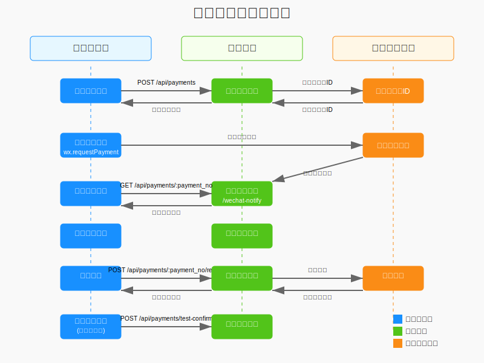

# 支付模块接口文档

## 1. 概述

本文档详细说明了电工平台支付模块的接口使用方法、微信支付对接流程、调试方法以及支付订单创建时机。

### 1.1 支付流程图

下图展示了支付模块的完整调用流程，包括创建支付订单、微信支付处理、支付回调、查询支付结果以及退款流程：



## 2. 支付接口调用

### 2.1 创建支付订单（支持预付款/维修费）

**接口地址**：`POST /api/payments`

**请求参数**：
```json
{
  "order_id": 123,                // 工单ID（必填）
  "payment_method": "wechat",    // 支付方式：wechat | test（默认wechat）
  "type": "prepay",               // 支付类型：prepay（预付款）| repair（维修费），默认prepay
  "openid": "wx-openid"           // 当payment_method=wechat时必填
}
```
**说明**：
- 当 `type=repair`（维修费）时，仅在订单状态为 `pending_repair_payment` 且支付方为订单用户时允许创建；
- 同一工单同一类型仅允许存在一个待支付订单（避免重复创建）；
- 支付成功后不会将订单主状态更新为 `paid`，维修费支付成功后订单仍保持在 `pending_repair_payment`，由电工调用 `PUT /api/orders/:id/start` 开始维修；

**响应结果**：
```json
{
  "code": 200,
  "message": "success",
  "data": {
    "payment_id": 456,            // 支付ID
    "payment_no": "P202510201234567890", // 支付单号
    "amount": 100.00,             // 支付金额（预付款来自服务类型配置，维修费来自订单最终金额）
    "prepay_id": "wx123456789",   // 微信支付预支付ID（当payment_method=wechat时返回）
    "sign": "ABCDEFG123456",      // 签名
    "timestamp": "1603123456"     // 时间戳
  }
}
```

### 2.2 查询支付状态

**接口地址**：`GET /api/payments/:payment_no`

**请求参数**：无（payment_no在URL中）

**响应结果**：
```json
{
  "code": 200,
  "message": "success",
  "data": {
    "payment": {
      "id": 456,
      "order_id": 123,
      "user_id": 789,
      "amount": 100.00,
      "payment_method": "wechat",
      "transaction_id": "4200000123456789",
      "out_trade_no": "P202510201234567890",
      "status": "success",        // 支付状态：pending（待支付）、success（已支付）、failed（失败）、refunded（已退款）
      // 说明：也可能为 expired（已过期），预付款默认30分钟过期关闭
      "paid_at": "2025-10-20 12:34:56"
    }
  }
}
```

### 2.3 测试支付确认（仅测试环境）

**接口地址**：`POST /api/payments/test/confirm`

**请求参数**：
```json
{
  "payment_no": "P202510201234567890" // 支付单号
}
```

**响应结果**：
```json
{
  "code": 200,
  "message": "success",
  "data": {
    "message": "测试支付确认成功"
  }
}
```

### 2.4 申请退款

**接口地址**：`POST /api/payments/:payment_no/refund`

**请求参数**：
```json
{
  "reason": "退款原因（可选，字符串，默认'用户申请退款'）"
}
```

**响应结果**：
```json
{
  "code": 200,
  "message": "success",
  "data": {
    "message": "退款申请已提交，请等待处理"
  }
}
```

### 2.5 获取支付列表

**接口地址**：`GET /api/payments`

**请求参数（Query）**：
```json
  {
    "page": 1,                    // 页码（可选，默认1）
    "limit": 20,                  // 每页数量（可选，默认20）
    "status": "success",          // 支付状态（可选：pending/success/failed/refunded）
    "payment_method": "wechat",   // 支付方式（可选：wechat/test）
    "search": "关键词"            // 搜索关键词（可选）
  }
```

**响应结果**：
```json
{
  "code": 200,
  "message": "success",
  "data": {
    "list": [
      {
        "id": 456,
        "order_id": 123,
        "amount": 100.00,
        "payment_method": "wechat",
        "out_trade_no": "P202510201234567890",
        "status": "success",
        "paid_at": "2025-10-20 12:34:56"
      }
    ],
    "total": 1,
    "page": 1,
    "limit": 20,
    "pages": 1
  }
}
```

### 2.6 获取支付统计

**接口地址**：`GET /api/payments/stats/summary`

**请求参数（Query）**：
```json
{
  "date_range": "{\"start\":\"2025-10-01\",\"end\":\"2025-10-31\"}" // 可选，JSON字符串
}
```

**响应结果**：
```json
{
  "code": 200,
  "message": "success",
  "data": {
    "stats": {
      "pending_count": 5,
      "success_count": 20,
      "failed_count": 1,
      "refunded_count": 2,
      "total_amount": 1234.56
    }
  }
}
```

### 2.7 微信支付回调

**接口地址**：`POST /api/payments/wechat/notify`

**请求参数**：微信服务端以XML提交（详见微信支付文档）

**响应结果**：XML（微信支付成功应答），例如：
```xml
<xml>
  <return_code>SUCCESS</return_code>
  <return_msg>OK</return_msg>
  <result_code>SUCCESS</result_code>
</xml>
```

### 2.8 处理退款（管理员）

**接口地址**：`PUT /api/payments/:payment_no/refund`

**请求参数**：
```json
{
  "action": "approve",          // 操作类型：approve | reject（必填）
  "admin_notes": "备注说明"       // 管理员备注（可选）
}
```

**响应结果**：
```json
{
  "code": 200,
  "message": "success",
  "data": {
    "message": "退款处理成功"
  }
}
```

## 3. 微信支付对接

### 3.1 对接流程

1. **前端调用创建支付接口**：
   - 调用 `POST /api/payments` 接口创建支付订单
   - 接收返回的支付参数（prepay_id、sign等）

2. **前端唤起微信支付**：
   ```javascript
   wx.requestPayment({
     timeStamp: data.timestamp,
     nonceStr: data.nonce_str,
     package: `prepay_id=${data.prepay_id}`,
     signType: 'MD5',
     paySign: data.sign,
     success(res) {
       // 支付成功，查询支付结果
       queryPaymentStatus(data.payment_no);
     },
     fail(err) {
       // 支付失败或取消
       console.error('支付失败', err);
     }
   });
   ```

3. **后端接收微信支付回调**：
   - 微信支付完成后，会向服务器发送异步通知
   - 服务器通过 `/api/payments/wechat/notify` 接口接收通知
   - 验证通知真实性，更新支付状态

4. **前端查询支付结果**：
   - 调用 `GET /api/payments/:payment_no` 接口查询支付状态
   - 根据返回的支付状态更新界面
   - 当为维修费（`type=repair`）且状态为 `success` 时：订单仍处于 `pending_repair_payment`，电工端可调用 `PUT /api/orders/:id/start` 开始维修

### 3.2 配置要求

- 需在微信支付商户平台配置支付回调地址：`https://your-domain.com/api/payments/wechat/notify`
- 需配置商户证书和密钥
- 需在小程序管理后台添加支付相关域名到白名单

## 4. 支付调试方法

### 4.1 测试环境调试

1. **使用测试支付模式**：
   - 创建支付时设置 `payment_method` 为 `test`
   - 调用 `POST /api/payments/test/confirm` 接口模拟支付成功

2. **查看支付日志**：
   - 服务器日志路径：项目根目录下的 `logs/payment.log`（具体路径以实际配置为准）
   - 包含支付创建、回调处理等详细信息

3. **使用微信支付沙箱环境**：
   - 在开发环境配置中启用沙箱模式
   - 使用沙箱专用的商户号和密钥

### 4.2 常见问题排查

1. **支付创建失败**：
   - 检查工单状态是否为 `pending_payment`（预付款）或 `pending_repair_payment`（维修费）
   - 检查用户是否有权限（仅订单用户可支付）
   - 检查是否已有同类型待支付订单

2. **支付回调未收到**：
   - 检查回调URL配置是否正确
   - 检查服务器防火墙设置
   - 查看微信支付商户平台的回调日志

3. **支付状态查询失败**：
   - 检查支付单号是否正确
   - 检查网络连接是否正常
   - 查看服务器日志中的错误信息

## 5. 支付订单创建时机与类型

### 5.1 适合创建支付订单的场景

1. **开始维修前（维修费）**：
   - 工单状态为 `pending_repair_payment` 时，用户应先支付维修费
   - 支付成功后订单状态保持为 `pending_repair_payment`
   - 电工端调用 `PUT /api/orders/:id/start` 开始维修

2. **预付款场景**：
   - 预约时根据服务类型 `prepay_amount` 创建预付款支付
   - 工单创建后状态为 `pending_payment`
   - 用户支付成功后订单状态变更为 `pending`（待接单）
   - 若 30 分钟内未支付，系统自动将支付标记为 `expired` 并将订单状态更新为 `closed`（交易关闭）

### 5.2 避免创建支付订单的情况

1. **不满足维修费支付条件**：订单未进入 `pending_repair_payment` 状态时拒绝创建维修费支付

2. **已有待支付订单**：同一工单已有待支付订单时，需先完成或取消现有支付

3. **工单已支付**：系统会检查工单支付状态，避免重复支付

## 6. 最佳实践

1. **前端实现**：
   - 工单预约页展示服务类型的预付款金额与备注说明
   - 创建支付时明确传入 `type`，默认预付款为 `prepay`
   - 支付过程中显示加载状态，完成后主动查询支付结果
   - 维修费支付在开始维修前启用（`type=repair`），支付成功后由电工发起开始维修

2. **异常处理**：
   - 实现支付超时处理机制（后端已内置 30 分钟超时关闭预付款）
   - 提供支付失败的重试选项
   - 支付取消后的友好提示

3. **安全建议**：
   - 所有支付相关接口必须使用HTTPS
   - 验证用户身份和权限
   - 支付金额与订单金额二次校验